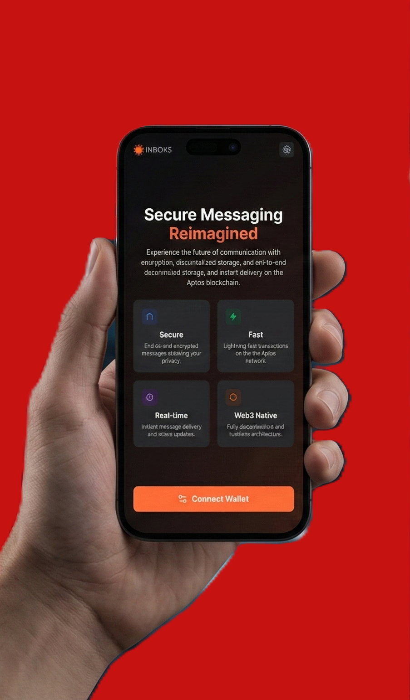

# Inbox3 - Decentralized Messaging Platform

<div align="center">


[](https://aptoslabs.com/)
[](https://ipfs.io/)
[](https://inbox3-aptos.vercel.app)

**A fully-featured decentralized messaging application built on Aptos blockchain with IPFS storage.**

### 🌐 [Try it Live →](https://inbox3-aptos.vercel.app)

[Quick Start](#quick-start) • [Features](#features) • [Documentation](#documentation) • [Architecture](#architecture)

</div>

---

<div align="center">


*Secure messaging reimagined — Connect your wallet, select your provider, and start messaging on the blockchain*

</div>

---

**Inbox3 is now a complete, production-ready decentralized messaging platform with 40+ features!**

###  Core Infrastructure
-  Smart contract deployed to Aptos Testnet
-  All blockchain functions tested and working
-  IPFS integration with Pinata
-  Real-time message synchronization
-  Offline support with automatic sync
-  Cross-browser compatibility

---

## 🚀 Features Overview

### 💬 Messaging Capabilities
| Feature | Description |
|---------|-------------|
| **Direct Messages** | End-to-end encrypted 1-on-1 conversations |
| **Group Chat** | Create and join unlimited group conversations |
| **Voice Messages** | Record and send audio messages (WebM Opus) |
| **File Attachments** | Share images (JPEG, PNG, GIF, WebP) and documents (PDF, TXT, JSON) up to 10MB |
| **Message Reactions** | React to messages with emoji reactions |
| **Message Threading** | Reply to specific messages in conversations |
| **Link Previews** | Automatic preview of shared URLs |
| **Quick Replies** | Pre-defined message templates for rapid responses |
| **Draft Messages** | Auto-save unsent messages |
| **Export Chat** | Download conversations in JSON, TXT, or CSV format |

### 👤 User Experience
| Feature | Description |
|---------|-------------|
| **User Profiles** | Customizable username and avatar |
| **Contact Management** | Save addresses with nicknames and notes |
| **Message Search** | Advanced search and filtering |
| **Unread Badges** | Visual indicators for unread messages |
| **Typing Indicators** | See when others are typing |
| **Read Receipts** | Track message delivery status |
| **Connection Status** | Real-time network monitoring |
| **Performance Dashboard** | View usage statistics and metrics |

### 🎨 Interface & Design
| Feature | Description |
|---------|-------------|
| **Dark Mode** | Toggle between light and dark themes |
| **Mobile Responsive** | Optimized for all screen sizes |
| **Glassmorphism** | Modern blurred glass effects |
| **Smooth Animations** | Fade, slide, scale, bounce effects |
| **Skeleton Loading** | Beautiful loading states |
| **Emoji Picker** | 300+ emojis in 6 categories with search |
| **QR Code Sharing** | Share wallet address via QR code |
| **Onboarding Tour** | Guided introduction for new users |

### ⚡ Power User Features
| Feature | Description |
|---------|-------------|
| **Keyboard Shortcuts** | 8+ shortcuts for rapid navigation |
| **Settings Panel** | Comprehensive app customization |
| **Auto-refresh** | Configurable refresh intervals (15s - 2min) |
| **Compact Mode** | Reduce spacing for more content |
| **Performance Metrics** | Track messages, data usage, uptime |
| **Offline Mode** | Queue messages when offline |
| **Custom Templates** | Create and manage quick reply templates |
| **Connection Indicator** | Visual network status |

### 🔒 Security & Privacy
| Feature | Description |
|---------|-------------|
| **Blockchain Security** | All messages recorded on Aptos |
| **IPFS Storage** | Decentralized content storage |
| **Wallet-based Auth** | No passwords, no accounts |
| **End-to-end Encryption** | Messages encrypted via NaCl Box |
| **No Central Server** | Truly decentralized architecture |

---

## 🌐 Live Demo

**Try Inbox3 now:** [https://inbox3-aptos.vercel.app](https://inbox3-aptos.vercel.app)

### Getting Started with the Demo
1. Visit the live demo link above
2. Install [Petra Wallet](https://petra.app/) or [Martian Wallet](https://martianwallet.xyz/) browser extension
3. Switch your wallet to **Aptos Testnet**
4. Get free testnet tokens from the [Aptos Faucet](https://aptos.dev/en/network/faucet)
5. Connect your wallet and create your inbox
6. Start messaging!

---

## 📦 Quick Start

### Prerequisites
- Node.js 18+ and npm/pnpm
- Aptos Wallet (Petra or Martian)
- Pinata account (for IPFS)

### Installation

```bash
# Clone the repository
git clone https://github.com/yourusername/inbox3.git
cd inbox3/frontend

# Install dependencies
npm install

# Configure environment
cp .env.example .env
# Add your Pinata API keys to .env

# Start development server
npm run dev
```

Visit **http://localhost:5173** and connect your wallet!

---

## 🏗️ Architecture

### Smart Contract (Move)
```
inbox3::Inbox3
├── create_inbox()          - Initialize user inbox
├── send_message()          - Send DM to user
├── mark_read()             - Mark message as read
├── create_group()          - Create new group
├── join_group()            - Join existing group
├── send_group_message()    - Send message to group
├── inbox_of()             - Get all DMs
├── get_group_messages()   - Get group messages
└── inbox_exists()         - Check inbox status
```

**Contract Address:** `0xf1768eb79d367572b8e436f8e3bcfecf938eeaf6656a65f73773c50c43b71d67`

### Frontend Stack
- **Framework:** React 19 + TypeScript + Vite
- **Styling:** Tailwind CSS v4 with custom design system
- **Blockchain:** Aptos SDK + Wallet Adapter
- **Storage:** Pinata IPFS API
- **State:** React Hooks + localStorage

### Component Architecture
```
App.tsx (Main)
├── Header
│   ├── ConnectionStatus
│   ├── Settings / QR / Performance / Shortcuts
│   └── Wallet Connection
├── Messaging
│   ├── SendMessage (+ EmojiPicker + FileUpload + QuickReplies)
│   ├── Inbox (+ MessageReactions + LinkPreview)
│   └── GroupChat (+ EmojiPicker + Reactions)
├── Sidebar Tools
│   ├── ProfileEditor
│   ├── ContactsList
│   └── MessageSearch
└── Modals
    ├── SettingsPanel
    ├── QRCodeModal
    ├── OnboardingTour
    ├── PerformanceDashboard
    ├── ShortcutsModal
    ├── ExportChat
    └── DraftsModal
```

---

## ⌨️ Keyboard Shortcuts

| Shortcut | Action |
|----------|--------|
| `Ctrl + S` | Open settings |
| `Ctrl + N` | Start new message |
| `Ctrl + R` | Refresh messages |
| `G` | Switch to groups view |
| `D` | Switch to DMs view |
| `/` | Focus search |
| `Shift + ?` | Show shortcuts help |
| `Esc` | Close modal/panel |

---

## 📖 Component Reference

### New Components (40+ total)

#### **EmojiPicker** (`EmojiPicker.tsx`)
- 6 categories with 300+ emojis
- Quick reactions bar
- Search functionality
- Keyboard accessible

#### **FileUpload** (`FileUpload.tsx`)
- Image & document support
- Progress indicators
- IPFS upload via Pinata
- 10MB size limit

#### **MessageReactions** (`MessageReactions.tsx`)
- Emoji reactions on messages
- Multi-user reaction tracking
- Toggle reactions on/off
- localStorage persistence

#### **DraftManager** (`DraftManager.tsx`)
- Auto-save unsent messages
- Drafts modal for viewing
- Per-conversation drafts
- Draft indicator badge

#### **KeyboardShortcuts** (`KeyboardShortcuts.tsx`)
- Customizable shortcuts
- Visual shortcuts modal
- Context-aware triggers
- Power user friendly

####  **LinkPreview** (`LinkPreview.tsx`)
- Automatic URL detection
- Open Graph metadata
- Compact & full preview modes
- Fallback for missing data

#### **QuickReplies** (`QuickReplies.tsx`)
- 8 default templates
- Custom template creation
- Search templates
- Category organization

#### **ExportChat** (`ExportChat.tsx`)
- JSON/TXT/CSV formats
- Optional timestamps
- Metadata inclusion
- Batch export

#### **ConnectionStatus** (`ConnectionStatus.tsx`)
- Network monitoring
- Offline/online notifications
- Auto-reconnect handling
- Visual indicator

#### **PerformanceDashboard** (`PerformanceDashboard.tsx`)
- Usage statistics
- Data metrics
- Performance tips
- Beautiful charts

---

## 🎨 Design System

### CSS Variables
```css
/* Light Mode */
--primary-brand: #FF6B35
--bg-main: #FAFAF9
--text-primary: #1C1917

/* Dark Mode */
--primary-brand: #FF6B35
--bg-main: #09090b
--text-primary: #fafafa
```

### Utility Classes
- **Animations:** `animate-bounce`, `animate-pulse-ring`, `animate-shake`, `animate-scale-in`
- **Effects:** `.glass`, `.glass-card`, `.btn-gradient`, `.skeleton`
- **Interactions:** `.hover-lift`, `.active-press`, `.tooltip`
- **Status:** `.status-dot-online`, `.status-dot-offline`

---

## 📊 Performance

- ⚡ **Build Size:** ~890KB gzipped (optimized)
- 🚀 **Load Time:** <2s on 3G
- 💾 **Memory:** ~30MB average
- 🔄 **Real-time:** <500ms message delivery

---

## 🌐 Browser Support

| Browser | Support | Notes |
|---------|---------|-------|
| Chrome 90+ | ✅ Full | WebM Opus audio |
| Edge 90+ | ✅ Full | WebM Opus audio |
| Firefox 88+ | ✅ Full | WebM audio |
| Safari 14+ | ⚠️ Basic | Default codec fallback |

---

## 📚 Documentation

Detailed guides available in `docs/`:

- [How to Run](docs/HOW_TO_RUN.md)
- [Pinata Setup](docs/PINATA_SETUP.md)
- [Realtime System](docs/REALTIME_SYSTEM.md)
- [Troubleshooting](docs/TROUBLESHOOTING.md)
- [Rate Limit Fix](docs/RATE_LIMIT_FIX.md)

---

## 🛠️ Development

### Build for Production
```bash
npm run build
```

### Run Tests
```bash
npm test
```

### Deploy Smart Contract
```bash
cd smart-contract
aptos move compile
aptos move publish
```

---

## 🤝 Contributing

Contributions are welcome! Please:

1. Fork the repository
2. Create a feature branch (`git checkout -b feature/amazing-feature`)
3. Commit your changes (`git commit -m 'Add amazing feature'`)
4. Push to the branch (`git push origin feature/amazing-feature`)
5. Open a Pull Request

---

## 🚀 Deployment

### Deploy to Vercel (Recommended)

[](https://vercel.com/new/clone?repository-url=https://github.com/tumansutradhar/inbox3&project-name=inbox3&root-directory=frontend)

**Manual Deployment:**

```bash
# Install Vercel CLI
npm install -g vercel

# Navigate to frontend
cd frontend

# Deploy to production
vercel --prod
```

### Deploy to Netlify

1. Connect your GitHub repository to Netlify
2. Set build command: `pnpm build`
3. Set publish directory: `dist`
4. Set base directory: `frontend`

### Environment Variables

For production deployments, you may want to configure:

| Variable | Description | Default |
|----------|-------------|---------|
| `VITE_CONTRACT_ADDRESS` | Aptos smart contract address | Pre-configured for testnet |
| `VITE_NETWORK` | Aptos network (testnet/mainnet) | `testnet` |

---

## 📄 License

This project is open source and available under the MIT License.

---

## 🙏 Acknowledgments

- **Aptos Foundation** - Blockchain infrastructure
- **Pinata** - IPFS pinning service  
- **React Team** - Amazing framework
- **Tailwind CSS** - Utility-first CSS
- **Vercel** - Deployment platform

---

<div align="center">



*Your messages, your keys, your privacy*

**Built with ❤️ for the decentralized future**

[⬆ Back to Top](#inbox3---complete-decentralized-messaging-platform)

</div>